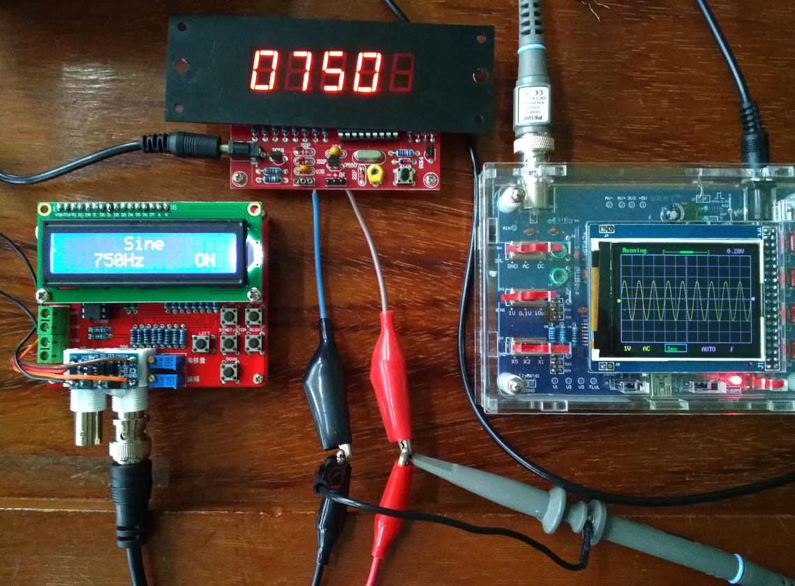

# 基於 DL4YHF frequency counter clone 的研究


<p align="left">
  
</p>


<p align="left">
  
  
  
</p>


## 為何建立這個倉庫
事有缘起，說來話長。當年的電子製作愛好者，什麼電子産品都想拆來看一下。為何小小零件集合後變得奇妙，諸如原子粒收音機，接上電源便聽得電台廣播聲音。上世紀七八十年代，玩過那麼一些東西，留下袛有點滴記憶。興趣未能餬口，揾食佔據生活日常，直至半退休生活初期，才慢慢抓回失落的興趣，新的舊的一大堆，有待探索。

那時候的電子儀器是天價般離地，DIY總有它的實在性。計頻器可能是當時玩無線電不可或缺的東西，沒能力負擔一台示波器，總不能少了計頻工具吧。辛苦地儲錢，花幾百塊錢，買了個紅色數字LED頻率計套件。某年搬家，忍心掉棄了，沒有留下照片。

時代進步，電子産品因為普及，價格反向下行。回歸電子世界後，見到的都想買來研究。可是年紀漸大，精力有限，那來這多時間。買這款[頻率計套件](assets/Taobao_clone.png)，沒有特別理由，袛因實在太平宜，用作[練習焊接技巧](assets/myboard_1.png)亦不錯。這類套件在淘寶隨處可見，採用了[PC16F628芯片](assets/PIC16F62X_DataSheet.pdf)作核心處理，十分簡潔，變種亦很多，但都袛得[簡單使用說明](assets/1-50Mhz_freq_counter_clone.pdf)。對什麼數碼管顯示英文字母感到茫然，究竟那是什麼呢。經過Google順藤摸瓜，尋源指向 [DL4YHF的綱頁](https://www.qsl.net/d/dl4yhf//freq_counter/freq_counter.html)，始知背後的真身。由它引伸變異版本的DIY，各具參考價值。因為日子久遠，部份連結已失效。

其中較喜歡以下幾款：
- KC7ZOW 在他的[網頁](https://kc7zow.tripod.com/hamradio/id6.html)介紹以PCB光板做成外殼，並提供幾種前置放大模式的參考。作品帶古舊味道，把內容製成[PDF檔案](assets/KC7ZOW_freq_counter.pdf)，方便查閱。
- F8FII 將數碼管擴展至6個，顯示方式固定為 XX.XXX.X MHz，他的[網頁](http://f8fii.com/ModFreqe.html)說明了原委，袛須硬件些少改動，靠修改[原始碼](assets/Other_code/pic_counter_6_digit.asm)來實現。
- PY2BBS 主要為硬件的構建，在其[網頁](https://www.py2bbs.qsl.br/freq_dl4yhf.php#gsc.tab=0)提供了清淅的[原理圖](assets/PY2BBS_freq_counter.pdf)及PCB圖，方便直接拿用來DIY。
- SM0VPO 簡約[版本](assets/SM0VPO_freq_counter.pdf)，移除了按鍵菜單的設置，配上精簡化的[原始碼](assets/Other_code/pic_counter_no-pgm5.asm).
- SQ3NQJ 在[DL4YHF的代碼](assets/DL4YHF_freq_counter/counter.asm)之上，增加外部二進制預分頻器(PreScaler)的[選單設置](assets/Other_code/pic_counter_Prescaler_add.asm)，適配不同前置預分頻器，擴展至更高頻率的測量。

建基於PIC芯片的頻率計事實上很多，也有以普及的LCD1602來作顯示的。其中 OM3CPH 在他[網頁](https://www.qsl.net/om3cph/counter/led/vhf_uhf.html)介紹使用 PIC16F84 的DIY，同樣是參照 [James Hutchby, MadLab Ltd. 1996](http://www.madlab.org/kits/frqmeter.html) 的設計，或可以認為這才是真正的元祖吧。[OM3CPH的原始碼](assets/Other_code/vhf_uhf.asm)年份標註為更早的2000年了，但還是[DL4YHF版本](assets/DL4YHF_freq_counter.pdf)較多模仿和版本改進，或因硬件相對複雜吧。

中國製造及販售的廉價仿製品，理所當然採用 DL4YHF 設計，取其低成本。這款賣點是加上晶掁測量，似乎好實用。它算是最忠於原著吧，固件想必直接拿用，但沒有交代何處取材。[ZL2PD的網頁](https://zl2pd.com/xtalchecker.html)有詳盡分析，並整理出[仿品的原理圖](assets/5_digit_counter_xtal_checker.gif)。用做[晶振測量](assets/myboard_2.png)有其局限，陽春的振蕩電路不太可靠。因此參考 [TheHWcave 的視頻](https://www.youtube.com/watch?v=0BxpMm6SLoE)，將該部份改成[簡單前置放大](assets/Chinese_clone_modification.pdf)，他同時有[代碼修改](https://github.com/TheHWcave/PIC-freq.counter-modification)建議。

這類單片機計頻工具，以代碼生成的固件是它的靈魂，那時候[研習PIC的編程](https://github.com/VR2XHQ/HJ-5G.X)，正好利用這台仿品作練習。代碼都以組合語言寫成，試過在 [MPLAB IDE 8.92](https://www.microchip.com/en-us/tools-resources/archives/mplab-ecosystem) 透過 [MPASM](https://ww1.microchip.com/downloads/en/DeviceDoc/33014g.pdf) 直接編繹成功。可能因為先學習 C/C++，組合語言又要由零起步，故一直閒置沒去研究了。最近[計劃將玩過的](https://github.com/VR2XHQ/sdcc_CH549)都滙入 GitHub 上保存記錄，因此製作這個倉庫。

## 製作固件的研究
經典的舊單片機代碼似乎都愛用上組合語言，相信是基於效率吧，[原作](assets/DL4YHF_freq_counter/counter.asm)也不例外。它採用 MPASM 來編譯，但 MicroChip 已將它淡出，要求[轉用](https://ww1.microchip.com/downloads/en/DeviceDoc/MPASM%20to%20MPLAB%20XC8%20PIC%20Assembler%20Migration%20Guide%2050002973A.pdf)內建 pic-as 的 [XC8](https://www.microchip.com/en-us/tools-resources/develop/mplab-xc-compilers/xc8)，支援 MPASM 語法的最後版本是 [MPLAB X IDE 5.35](https://www.microchip.com/en-us/tools-resources/archives/mplab-ecosystem)。若要用上新版本，必須將代碼做調整。

感覺 MicroChip 處理 assembly compiler 的過渡搞得十分混亂，網絡上片言隻字的說法，都不盡相同，令人迷惑。參照 [IU8NQI 的方法](https://github.com/StarNiell/PIC16F628A_AS_DL4YHF.X)，成功移植可以編繹的 [DL4YHL 版本](counter_pic-as.s)。但能夠編繹不等於能用，初試失敗，經排查發現一行輸入錯誤，竟導致實際無法運行。[固件](assets/test/1-50Mhz_freq_counter_clone.X.production.hex)雖然最終完成了，但亦說明組合語言在某程度上的艱難，修改源碼不易。

IU8NQI 採用的是[這個由 Ho-Ro 改良的版本](https://github.com/Ho-Ro/DL4YHF-Frequency-Counter/blob/main/counter.asm)，看罷 [Ho-Ro GitHub](https://github.com/Ho-Ro/DL4YHF-Frequency-Counter) 介紹，因為他仍用「舊」語法來做開發，才知使用 [gputils](https://gputils.sourceforge.io) 也能夠讓這些舊組合語言的代碼進行編繹，無需移植到 pic-as。同時也有好用的燒錄工具 [pk2cmd](https://github.com/jaka-fi/pk2cmd)，在 Linux 環境下輕鬆完事。對[元祖的代碼](assets/frqmeter/frqmeter.asm)進行編繹，順利生成[固件](assets/frqmeter/frqmeter.hex)，令我這個小白變得自信滿滿。

雖然 gpasm 好用，但現時目標是做迭代更新實驗，新的 [pic-as](https://ww1.microchip.com/downloads/en/DeviceDoc/MPLAB%20XC8%20PIC%20Assembler%20User's%20Guide%2050002974A.pdf) 會繼續發展，是有必要認識的。事實上進行舊代碼的移植，也是不錯的學習。能夠找到的資料，比較碎片化，以下是部份。

- https://www.circuitbread.com/tutorials/mpasm-to-mplab-xc8-pic-assembler
- https://www.circuitbread.com/tutorials/series/microcontroller-basics (這是教學，對初學PIC組合語很有幫助。)
- https://github.com/thetrung/ASM_BLINK_PIC18F45k50
- https://github.com/dsoze1138/MPLABX_pic-as_examples
- https://github.com/rorticus/mpasm-picas (自動化轉換，但不知如何入手。)

## MPASM ==> XC8 PIC-AS
以下筆記是這次移植主要修改之處：
- #include <xc.inc> 取代 list P=16F628, #include <p16F628.inc>
- #define, #if, #ifdef, #else, #endif 尾後不可加備註，必需移走。
- 所有 label 都要加上冒號，例如 label:
- 程式尾末 END 要加上 reset vector 的進入點 label，例如 END resetVec，往後的行不允許其他內容，包括備註行，否則編繹報錯。。IDE設定 -Wl,-PresetVec=0x0" in pic-as global options (Additional Options) of Project Properties。
- __CONFIG __XT_OSC 改成 CONFIG FOSC = XT, 如此類推。
- __IDLOCS H'XXXX' 改成 CONFIG IDLOC[0..3] = 0xXX
- b'10110011' 改成 10110011B
- 10進位數目字前刪去 dot
- de 改為 db
- (value>>.16)&0xFF 改成 (value>>16) and 0xFF
- ORG 設定區段要改用 PSECT，具體表述及參數看 official guide，要驗証。
- skpnc, skpc, skpnz, skpz, tstf, clrc, setc, bc, bnc, bz, bnz, 要改以其他語法去實現相同效果。設計成對應的 marco，就不用每行去修改。這昰 IU8NQI 採用的方法，相當好用。
- movfw XXX 語法不再使用，要改為 movf XXX, w
- errorlevel 語句不再使用，直接刪除。
- bsf STATUS, RP0 改為「長寫法」bsf STATUS, STATUS_RP0_POSITION，如此類推。
- 使用 MPLAB X IDE, 加上 PROCESSOR 16F628 似乎不是必需。
- 加上 RADIX DEC 似乎也不昰必需，因為預設應該就是10進數系。


## 學習 PIC 組合語言(滙編語言)
單片機跟組合語言有密切的關係，事實亦十分好玩。要學習當然要有教材，程式語言句法無論怎樣演變，都是累積而成，有它的基礎原理存在。這兩冊 [基礎篇](assets/PIC单片机实用教程-基础篇.pdf)和[提高篇](assets/PIC单片机实用教程-提高篇.pdf) 已經有二十多年歷史，在中國算是官方教材吧，仍有參考價值，但確實費時去看，暫寄存在此，留待日後吧。

中國電子科技的發展，人才在這幾十年確實有很大進步，這些教材功不可抹。

## 試驗燒寫與反組繹
使用 pk2cmd 及 gpdasm 做了以下驗証，放到[這目錄](assets/test/)下。
首先讀取仿品的固件內容，保存為 [counter_clone.hex](assets/test/counter_clone.hex)。對照 DL4YHF [counter2.hex](assets/test/counter2.hex)，結果與芯片上代碼袛[有一處不同](assets/test/diff.txt)。然後直接燒寫counter2.hex，正常運行。用 diff 比較兩個hex，差異很大。初時認為屬正常，因為按intel hex的[格式本質](assets/intel_hex_format.md)(問AI的)，明白機械碼的一點差別，會造成hex檔內的每行記錄的檢查碼變化，直接比較變得沒意義。及後才察覺是行末的 CR/LF 作怪，轉換之後，[差異變得合理了](assets/test/diff.txt)。最後嘗試反組繹，兩者生成的[asm，基本上相同](assets/test/diff.txt)，跟 pk2cmd 作比較的[結果吻合](assets/test/diff.txt)。分析hex檔，原因是 [IF_TABLE](assets/test/diff.txt) 改了，eep_dw  4433619 變成 4433421，[顯示變成](assets/myboard_5.png)這樣。為何這樣，原因不詳，相信是源碼被無故改動，而固件生成後一直在複製翻用。
```bash
pk2cmd -PPIC16F628A -GFcounter_clone.hex
pk2cmd -PPIC16F628A -Fcounter2.hex -Y
file counter2.hex
dos2unix counter2.hex
diff -u counter_clone.hex counter2.hex
gpdasm -p PIC16F628A counter2.hex > counter2.asm
gpdasm -p PIC16F628A counter_clone.hex > counter_clone.asm
diff -u counter_clone.asm counter2.asm
```
進一步試驗，把 IU8NQI 的原始碼[編繹成固件](assets/test/PIC16F628A_AS_DL4YHF.X.production.hex)，另下載他提供的hex，以上述相同的驗証方法，結果兩者的hex及[反組繹asm](assets/test/PIC16F628A_AS_DL4YHF.X.production.asm)都吻合，並[成功燒寫運行](assets/myboard_4.png)。

燒錄器採用了 PICKIT2 clone，配以 MPLAB X IDE v6.15，XC8 v3.00，PIC16Fxxx_DFP/1.7.162，初時將芯片離板進行燒寫，插拔比較麻煩，於是由板子直接引線出來，進行在板燒寫，暫時未發現有異常情況。在 Linux 使用，要加 [60-pickit.rules](assets/60-pickit.rules) 到 /etc/udev/rules.d/。選項的使用，參照 CLI [顯示的說明](assets/pk2cmd.txt)。

```bash
pk2cmd -PPIC16F628A -Fcounter_clone.hex -E -M -Y
pk2cmd -PPIC16F628A -R
```


## 倉庫的目錄結構
```text
1-50Mhz_freq_counter_clone.X/
├── assets/           圖片展示，PDF文件，代碼，等等資料。
├── nbproject/        専案資料
├── Makefile          IDE的自動化文件
├── counter_pic-as.s  展示的移植代碼
└── README.md         本說明文件
```

## 其他參考網頁
- https://github.com/linker3000/DL4YHF-Frequency-Meter
- https://github.com/erichVK5/DL4YHF-FrequencyCounterVK5Mods
- https://radioman.ee/radioman/counter/
